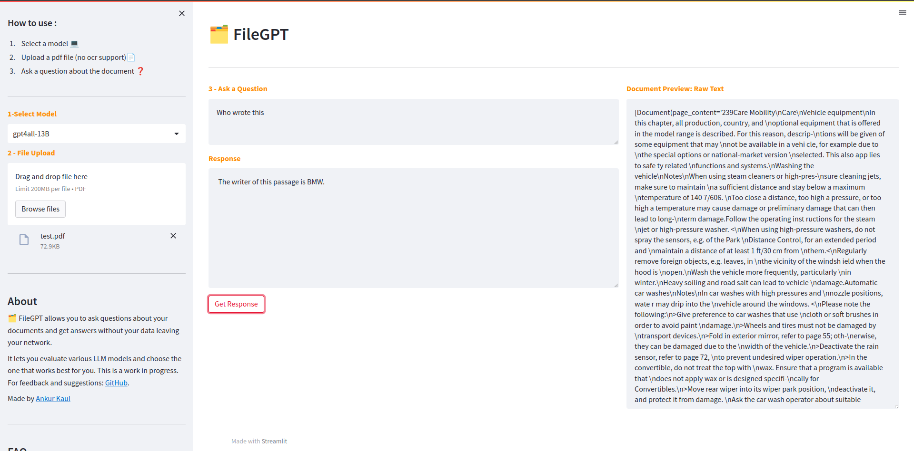

<h1 align="center"> FileGPT: Local cognitive search over a pdf </h1>
</br>
<p align="center"></p>
</br>
</br>

## Steps to run the model locally
</br>
 
 - clone this repository
   ```bash
      git clone https://github.com/allthatido/FileGPT.git

 - Navigate to the `models` folder

 - Download the LLama family model (GGML V3 only) you want to test. Refer to README.md in the `models` folder.

 - install dependencies
   ```bash
      pip install -r requirements.txt

 - Start streamlit app
   ```bash
      streamlit run app.py
 
 - Open browser and go to http://localhost:8501/
